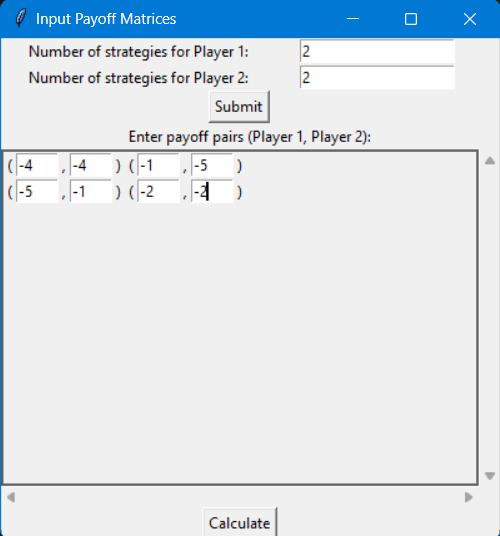
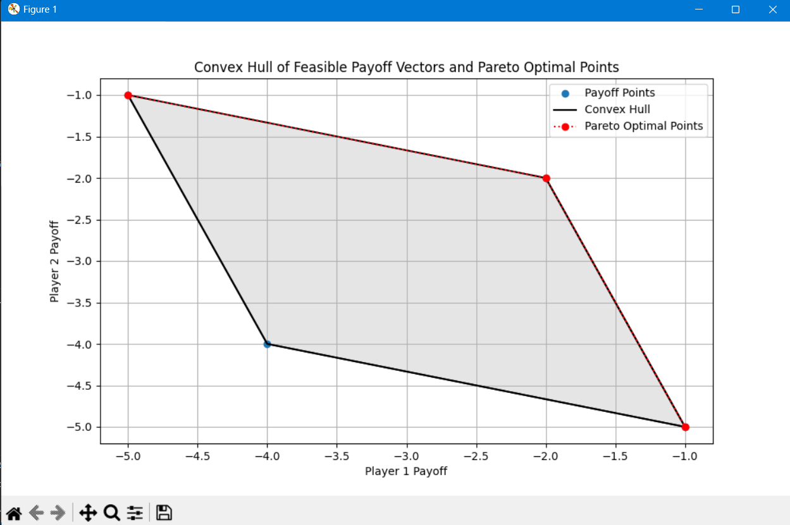

# General-Sum Two-Person Game Payoff Visualization

This project is a Python application that allows users to input a general-sum two-person game matrix and visualize the convex hull of all feasible payoff vectors along with Pareto optimal points. The convex hull is depicted with lines connecting the Pareto optimal points.

## Features

- User-friendly graphical interface for inputting payoff matrices.
- Visualization of feasible payoff vectors.
- Identification and plotting of Pareto optimal points.
- Display of convex hull with lines connecting Pareto optimal points.
- Support for scrolling to accommodate large matrices.

## Requirements

- Python 3.x
- Tkinter (usually included with Python)
- NumPy
- Matplotlib

## Installation

1. Clone the repository:

    ```sh
    git clone https://github.com/moh-skec/Convex-Hull.git
    cd Convex-Hull
    ```

2. (Optional) Create a virtual environment:

    ```sh
    python -m venv venv
    source venv/bin/activate  # On Windows use `venv\Scripts\activate`
    ```

3. Install the required packages:

    ```sh
    pip install numpy matplotlib
    ```

## Usage

1. Run the application:

    ```sh
    python Convex_hull.py
    ```

2. Enter the number of strategies for Player 1 and Player 2, then click "Submit".

3. Input the payoff pairs in the provided matrix format.

4. Click "Calculate" to visualize the results.

## Example

1. After running the application, you will see input fields for the number of strategies for both players.
2. Enter the number of strategies and click "Submit".
3. A matrix input grid will appear where you can enter the payoff pairs for each strategy combination.
4. Click "Calculate" to see a plot of feasible payoff vectors, the convex hull, and Pareto optimal points.

## Screenshots


*Example of the matrix input screen.*


*Example of the output plot showing the convex hull and Pareto optimal points.*

## License

This project is licensed under the MIT License. See the [LICENSE](LICENSE) file for details.

## Acknowledgements

- Inspired by game theory concepts and visualizations.
- Developed using Tkinter, NumPy, and Matplotlib.

## Contributing

1. Fork the repository.
2. Create a new branch (`git checkout -b feature-foo`).
3. Commit your changes (`git commit -am 'Add some foo'`).
4. Push to the branch (`git push origin feature-foo`).
5. Create a new Pull Request.

## Contact

For any inquiries, please contact [Shahpoorymohammadhossein@gmail.com](mailto:Shahpoorymohammadhossein@gmai.com).
